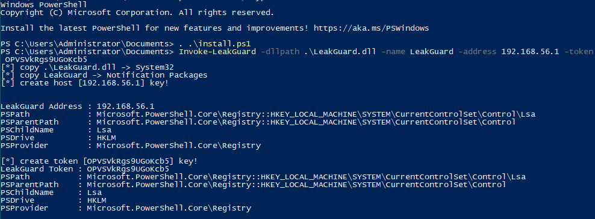

# Leak Guard

[](https://github.com/xiosec/LeakGuard)
[](https://github.com/xiosec/LeakGuard)
[](https://github.com/xiosec/LeakGuard) [](https://github.com/xiosec/LeakGuard/releases/)
[](https://github.com/xiosec/LeakGuard/issues)


<p align="center">
<i>LeakGuard is a project to prevent the use of leaked passwords</i>
</p>

LeakGuard has a [custom password filter](https://learn.microsoft.com/en-us/windows/win32/secmgmt/password-filters) module for Windows (Active Directory) which is loaded in the [lsass](https://learn.microsoft.com/en-us/windows-server/security/windows-authentication/credentials-processes-in-windows-authentication) process, and when a request is made to change or set a password for a user, this module sends the password to the server to check its leaking status. If the password has already been leaked, setting this password will be prevented.

## Description

I have always wanted to create a project that checks whether a user's password has already been leaked or not before choosing a password.
There are challenges for such a project, including the high volume of leaked passwords and the speed of password searches
In this project, elasticsearch is used to search passwords, which has an acceptable speed.

In one of the tests, the amount of time spent searching in `1,440,604` passwords was `3.6251095ms` on average.


# Setup and installation

To start the server, just run the following command in the [service](service/) folder:

```bash
docker-compose up
```

In the case of the Windows module, you must first compile the project and install it with the [install.ps1](module/install.ps1) script with the following command:

```powershell

PS C:\> . .\install.ps1
PS C:\> Invoke-LeakGuard -dllpath .\LeakGuard.dll -name LeakGuard -address <IP>:<PORT> -token <TOKEN>
```


## License

© 2023 [xiosec](https://github.com/xiosec)